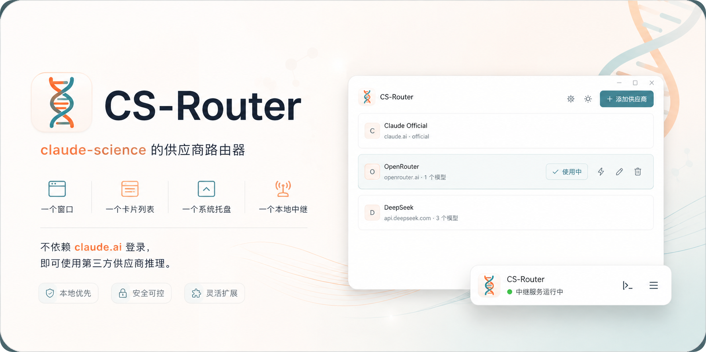

# CS Router



A provider router for claude-science. One window, one card list, one system tray, one local relay — no claude.ai login required to use third-party inference.

## Architecture

```
cs-router/
├── src-tauri/
│   ├── src/
│   │   ├── main.rs          # Storage, tray, window, commands, lifecycle
│   │   ├── relay.rs         # Local relay: model catalog + role mapping + 307/forward
│   │   ├── oauth_forge.rs   # Virtual login: forge local OAuth token
│   │   └── model_fetch.rs   # Model list fetch with candidate URL rules
│   ├── icons/
│   │   ├── icon.png         # App icon 512px, rounded rectangle
│   │   └── tray.png         # Tray icon 22px, rounded rectangle
│   ├── Cargo.toml
│   ├── tauri.conf.json
│   └── capabilities/
│       └── default.json     # Window permissions
├── ui/
│   ├── index.html           # Single-page layout
│   ├── main.js              # State, rendering, optimistic switching
│   ├── style.css            # Theme tokens, Anthropic serif + MiSans
│   ├── logo.png             # Brand mark
│   └── banner.png           # Release banner
├── LICENSE                  # MIT
└── README.md
```

## Build

System dependencies: `libwebkit2gtk-4.1-dev`, `build-essential`; for deb bundling additionally `libayatana-appindicator3-dev`, `librsvg2-dev`.

```sh
cargo install tauri-cli --locked
cd src-tauri && cargo tauri build
```

## How it works

**Storage** — `~/.cs-router/config.json` (0600). Each provider carries name, notes, website, endpoint, auth field, upstream format, API key, default model, model catalog, role mappings. Empty endpoint means the official login entry; editable and deletable like any other card.

**Virtual login** — `oauth_forge.rs` forges a far-future-expiring OAuth token inside `~/.claude-science` using the local `encryption.key` via HKDF-derived AES-256-GCM. The token's `access_token` carries the current provider key. The web UI therefore stays authenticated, fully decoupled from claude.ai network reachability.

**Local relay** — `relay.rs` listens on 127.0.0.1:39171. The daemon's base URL points here: model list requests are answered from the registered catalog using `claude-csswitch-` selector IDs (the UI shows exactly your registered models); message requests have their model field rewritten then forwarded to the real provider with streaming responses passed through. Model name resolution is three-tier: selector table hit, claude-family role mapping, fallback to default model.

**Switching** — Click to switch, effective immediately. Not running: launches with the new provider. Running: stops then relaunches with new environment. All background-serialised, UI updates optimistically with zero wait.

## Disclaimer

This is a community open-source tool. It is not affiliated with, partnered with, or endorsed by Anthropic, Claude, or any model provider. All trademarks belong to their respective owners and are referenced descriptively only.

The virtual login mechanism forges a local token within the machine's own data directory, used solely as a UI authentication marker. It does not fabricate, intercept, or store any real account credentials. Users are responsible for complying with the terms of service of their providers. All consequences arising from the use of this tool are borne by the user.

This project collects no data and uploads nothing. Provider keys are stored only in the local `~/.cs-router/config.json` with 0600 permissions.

## License

MIT
